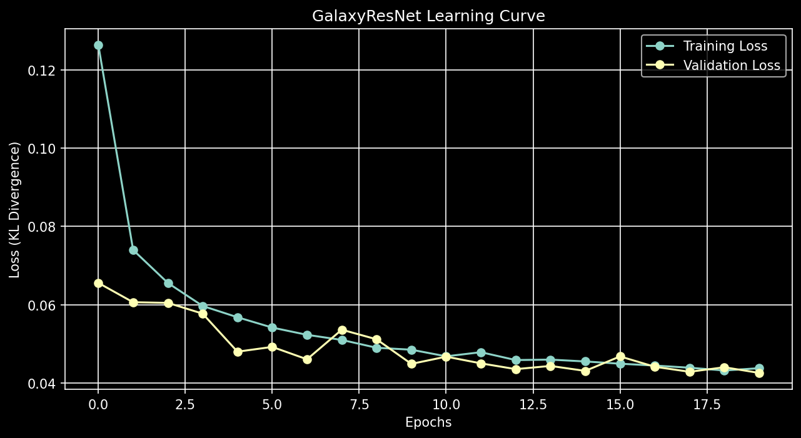
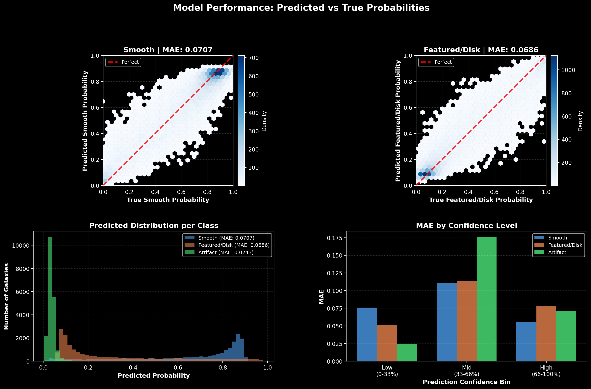
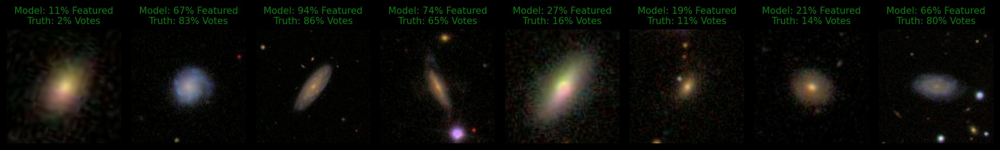

# Galaxy Zoo 2 Classification

Deep learning model for morphological classification of galaxies using the Galaxy Zoo 2 dataset.

## Overview

This project implements a convolutional neural network to classify galaxy morphologies based on citizen science voting data from Galaxy Zoo 2. The model predicts probability distributions across three primary morphological classes: smooth, featured/disk, and artifact.

## Dataset

- **Source**: Galaxy Zoo 2 (GZ2)
- **Size**: 167,434 galaxy images
- **Image Resolution**: 224×224 pixels (RGB)
- **Labels**: Crowd-sourced vote fractions across morphological features

## Model Architecture

**GalaxyResNet**: Transfer learning with pretrained ResNet18
- **Base Model**: ResNet18 (ImageNet pretrained)
- **Frozen Layers**: layer1, layer2 (early feature extraction)
- **Fine-tuned Layers**: layer3, layer4, fc (galaxy-specific features)
- **Parameters**: ~11.2M total | ~5.6M trainable
- **Input**: 224×224×3 normalized images
- **Output**: 3-class probability distribution
- **Loss Function**: KL Divergence (vote fraction matching)

### Architecture Details
```
ResNet18 Backbone (pretrained on ImageNet)
├── layer1 (64-128 channels)   [FROZEN]
├── layer2 (128-256 channels)  [FROZEN]
├── layer3 (256-512 channels)  [Trainable]
└── layer4 (512 channels)      [Trainable]

Classifier Head
└── Dropout(0.5) → Linear(512 → 3 classes)
```

## Results

| Metric | Value |
|--------|-------|
| Best Validation Loss | (see training) |
| Training Epochs | Up to 20 (with early stopping) |
| Training Samples | 16,000 |
| Validation Samples | 20,000 |
| Batch Size | 64 |
| Early Stopping Patience | 5 epochs |

**Performance Metrics** (per class MAE):
- **Smooth**: MAE tracked during training
- **Featured/Disk**: MAE tracked during training  
- **Artifact**: MAE tracked during training

### Learning Curves



### Prediction Performance




## Training Configuration

- **Learning Rate**: 3e-4 (Adam optimizer)
- **Batch Size**: 64
- **Epochs**: up to 20 with early stopping (patience=5)
- **Loss Function**: KL Divergence (batchmean reduction)
- **Scheduler**: ReduceLROnPlateau (patience=2, factor=0.5)
- **Data Augmentation** (training only):
  - RandomHorizontalFlip (p=0.5)
  - RandomVerticalFlip (p=0.5)
  - ColorJitter (brightness=0.2, contrast=0.2)
  - RandomRotation (±90°)

## Requirements

- Python 3.8+
- PyTorch 2.0+
- CUDA 12.0+ (for GPU training)
- See `requirements.txt` for full dependencies

## Installation

```bash
# Clone repository
cd GZ2

# Install dependencies
pip install -r requirements.txt
```

## Usage

### Training

```python
# Open and run the notebook
jupyter notebook GalaxyZoo2Model.ipynb
```

The notebook will:
1. Download the GZ2 dataset to `./data/` (167k images)
2. Create train/val splits (16k / 20k samples)
3. Train GalaxyResNet on CUDA if available
4. Save best checkpoint + final model to `./models/`
5. Generate visualizations in `./plots/`

**Example Predictions on Validation Set:**




### Inference
Run the inference script on any galaxy image:

```bash
python inference.py
```


## Hardware & Performance

**Tested on:**
- **GPU**: NVIDIA GeForce RTX 3060 Laptop (6.44 GB VRAM)
- **CUDA**: 12.6
- **Framework**: PyTorch 2.0+
- **Expected Training Time**: ~20-30 minutes for 20 epochs with early stopping

**Optimizations:**
- **Transfer Learning**: Frozen early layers preserve pre-trained ImageNet features
- **Mixed Precision**: cuDNN benchmark enabled for optimal kernel selection
- **GPU Memory**: pin_memory=True for faster CPU→GPU transfers
- **Early Stopping**: Prevents overfitting while maximizing validation performance
- **Learning Rate Scheduling**: ReduceLROnPlateau adapts LR based on validation loss

## References

- **Galaxy Zoo 2**: Willett et al. 2013 - [Galaxy Zoo 2: detailed morphological classifications for 304,122 galaxies](https://academic.oup.com/mnras/article/435/4/2835/1079261)
- **Dataset**: [galaxy-datasets Python package](https://github.com/mwalmsley/galaxy-datasets)
- **ResNet18**: He et al. 2015 - [Deep Residual Learning for Image Recognition](https://arxiv.org/abs/1512.03385)
